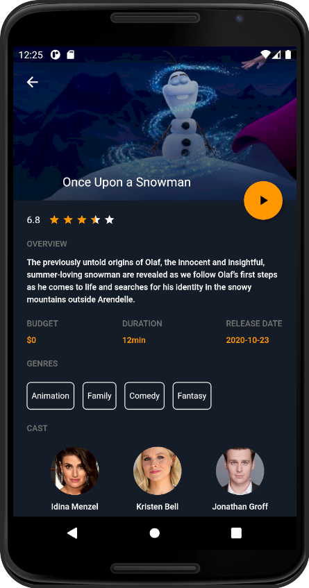

<h1 align="center">Movie App</h1>

<p align="center">


</p>

## About The Project

_A simple mobile application that allows you to search for movies using free TMDb API. The use of the Flutter framework allowed to creation of the application for Android and iOS devices using one codebase.
To build an easy to develop and maintainable app, I split the code into independent layers and depend on abstractions instead of concrete implementations.
To manage state, I used the Bloc library to separate the presentation from the business logic._

<br/>

<p align="center">
  
</p>

<p align="center">
  
</p>

## Features

- Filtering movies
- Displaying details of the movie

## Built With

| Client                                                                                                           | Server                                                                                                           |
| ---------------------------------------------------------------------------------------------------------------- | ---------------------------------------------------------------------------------------------------------------- |
| [Dart](https://dart.dev/guides)                                                                                  | [The Movie DB API](https://developers.themoviedb.org/3/getting-started/introduction)                                |
| [Flutter](https://flutter.dev/docs)                                                                                      |
| [Bloc](https://bloclibrary.dev/#/)                                                                
    
## Getting Started

### Prerequisites

- Flutter and Dart SDK

### Installation

1. **Open iOS or Android emulator.**
      
2. **Run the following command in the root of the repository.**

```shell
flutter run
```

## License

This project is licensed under the MIT License.

## Contact

**Krzysztof Talar** - [Linkedin](https://www.linkedin.com/in/ktalar/) - krzysztoftalar@protonmail.com
